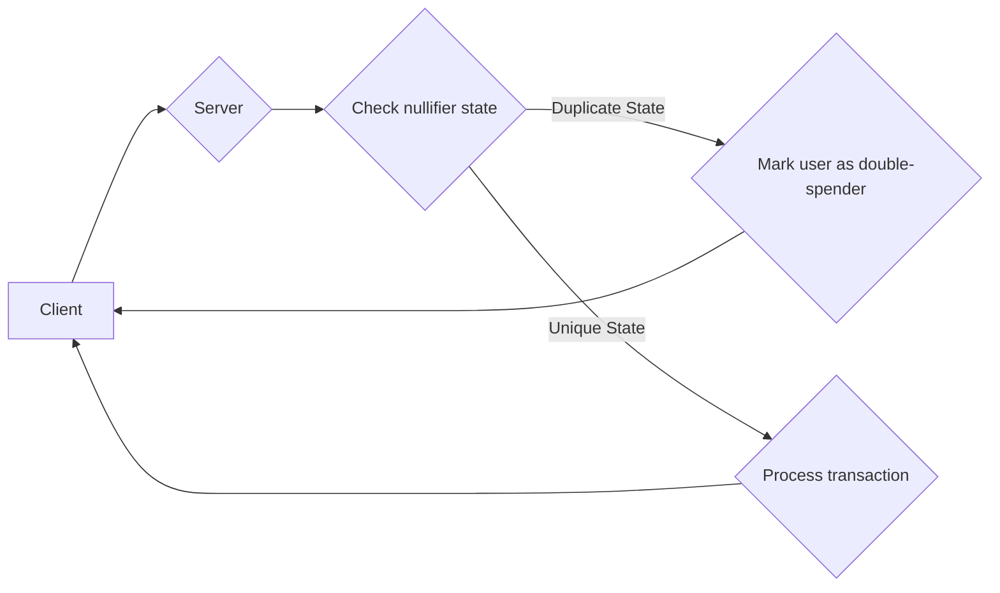
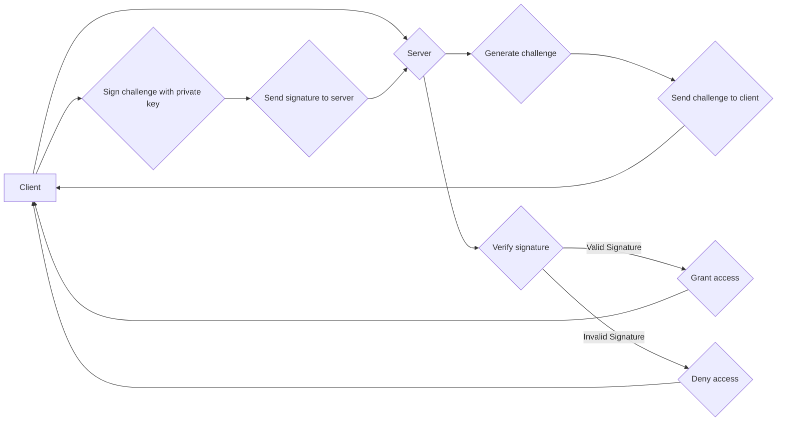
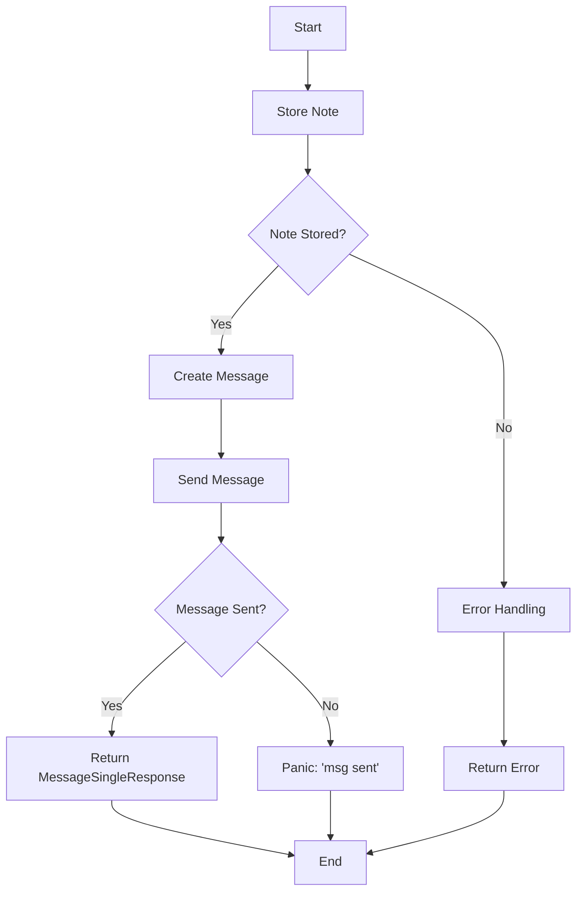

## Specification (WIP):
https://hackmd.io/@THkehD-JRa6LxfeK0QB2pw/rkLVvK5DA

## IOU Service with Double-Spending Prevention

This Rust server provides a backend service for managing IOUs (I Owe You), with a focus on preventing double-spending. It utilizes MongoDB for data persistence and EDDSA (Edwards-curve Digital Signature Algorithm) for authentication and security.

### Why Double-Spending Prevention?

Double-spending is a significant problem in digital currency systems, where a user attempts to spend the same digital asset multiple times. In an IOU system, this could mean someone tries to "redeem" the same IOU more than once.

This server implements a mechanism to detect and prevent double-spending using:

- **Nullifiers:** Unique cryptographic identifiers generated whenever an IOU is redeemed or transferred.
- **State Management:** Nullifiers are associated with states, tracking the usage history of an IOU.
- **Betrayal Detection:**  The system checks for duplicate nullifier states to detect double-spending attempts.

### Core Features

- **User Management:**
  - Create new users.
  - Store user public keys for authentication.
  - Track user IOUs and messages.
- **IOU (Note) Management:**
  - Store and manage IOU details (asset, value, owner).
  - Track IOU history (transfers, redemptions).
- **Messaging:**
  - Users can send messages with optional attachments.
  - Unread messages are marked as read upon retrieval.
- **Double-Spending Prevention:**
  - Generate and store nullifiers associated with IOU transactions.
  - Check for duplicate nullifier states to detect double-spending attempts.
- **Challenge-Response Authentication:**
  - Uses EDDSA for secure, passwordless authentication.
  - Clients sign randomly generated challenges to prove ownership of their private keys.

**1. Double-Spending Detection:**



**2. Challenge-Response Authentication (currently not in use):**



**3. Transfer Note History between users:**



### HTTP Post requests:


**Create users:**

username must be unique

```ts
curl -X POST -H "Content-Type: application/json" -d '{"username": "onur", "pubkey": "1234", "nonce": "0", "messages": [], "notes": [], "has_double_spent": false}' http://localhost:3000/create_user
```

**Send messages:**

```ts
curl -X POST -H "Content-Type: application/json" -d '{"recipient": "sero", "sender": "test", "message": "almost done, world", "attachment_id": "1"}' http://localhost:3000/send_message
```

**Store Nullifier & State:**

Nullifier and state must be unique.

```ts
curl -X POST -H "Content-Type: application/json" -d '{"nullifier": "nul-1", "note": "1", "step": 2, "owner": "onur", "state": "1"}' http://localhost:3000/store_nullifier
```

**Store Notes:**

```ts
curl -X POST -H "Content-Type: application/json" -d '{"owner": "123", "asset_hash": "1", "value": 1, "step": 1, "parent_note": "hashed note", "out_index": "1", "blind": "random"}' http://localhost:3000/store_note
```